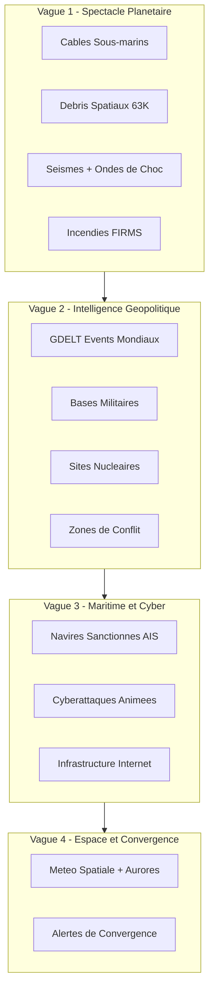

# SeeYou Intelligence Platform - Plan de transformation

## Etat actuel

9 couches (Aircraft, Satellites, Traffic, Cameras, Weather, Wind, METAR, Events, CityLabels), ~12 APIs, shaders militaires, predictions IMM-EKF. Architecture: React/Cesium frontend, Rust/Axum backend, Redis cache, WebSocket.

## Architecture des nouvelles couches

Chaque nouvelle couche suit le pattern existant :

- **Backend** : nouveau crate dans `backend/crates/` avec service tracker + handler API
- **Frontend** : nouveau composant `*Layer.tsx` dans `frontend/src/components/` utilisant Primitive Collections
- **Cache** : Redis avec TTL adapte a la frequence de mise a jour
- **WebSocket** : nouveau type de message pour les donnees temps reel




---

## VAGUE 1 : Spectacle Planetaire (impact visuel maximum, APIs les plus simples)

### 1.1 Cables Sous-marins

**API** : TeleGeography ArcGIS FeatureServer (gratuit, sans auth, JSON)

- Endpoint cables : `https://services.arcgis.com/.../FeatureServer/0/query`
- Endpoint landing points : `https://services.arcgis.com/.../FeatureServer/1/query`

**Backend** : Nouveau crate `backend/crates/cables/`

- Service qui fetch les cables au demarrage (donnees quasi-statiques, refresh 24h)
- Handler REST `/cables` retournant les geometries GeoJSON
- Cache Redis TTL 24h

**Frontend** : `SubmarineCableLayer.tsx`

- Polylines lumineux avec `PolylineMaterial` type `glow` (couleur cyan/bleu)
- Points de connexion (landing points) en `PointPrimitiveCollection`
- `DistanceDisplayCondition` : visible a partir de 5000km d'altitude
- Hover tooltip avec nom du cable, longueur, operateur, capacite

**Rendu** : Cables lumineux cyan pulsant sur fond de globe sombre = visuellement spectaculaire

### 1.2 Debris Spatiaux (extension satellite layer)

**API** : CelesTrak (deja utilise) - etendre aux catalogues supplementaires

- `https://celestrak.org/NORAD/elements/gp.php?GROUP=active&FORMAT=json` (actifs)
- `https://celestrak.org/NORAD/elements/gp.php?GROUP=analyst&FORMAT=json` (debris)
- Space-Track.org pour le catalogue complet (63K+, inscription gratuite)

**Backend** : Etendre `backend/crates/satellites/` 

- Ajouter des groupes TLE supplementaires : debris, rocket bodies, analyst objects
- Chunked WebSocket delivery (deja en place, augmenter la capacite)
- Nouveau type `SpaceDebris` distinct des satellites operationnels

**Frontend** : `SpaceDebrisLayer.tsx` (separe de SatelliteLayer pour les controles)

- `PointPrimitiveCollection` (pas de billboards pour 63K objets - trop lourd)
- Points de 1-3px selon la taille, couleur par categorie (debris = rouge, rocket body = orange, active = vert)
- SGP4 propagation dans Web Worker (le stub existe deja dans `frontend/src/workers/`)
- `NearFarScalar` agressif : invisible en dessous de 2000km d'altitude camera

**Performance** : 63K PointPrimitives dans une seule collection = 1 draw call. Faisable.

### 1.3 Seismes + Ondes de Choc Animees

**API** : USGS Earthquake GeoJSON Feed (gratuit, sans auth, temps reel)

- `https://earthquake.usgs.gov/earthquakes/feed/v1.0/summary/2.5_day.geojson` (M2.5+ dernier jour)
- `https://earthquake.usgs.gov/earthquakes/feed/v1.0/summary/significant_month.geojson` (significatifs du mois)

**Backend** : Nouveau crate `backend/crates/seismic/`

- Polling toutes les 5 minutes
- Cache Redis TTL 5min
- Handler REST `/seismic` + WebSocket `SeismicUpdate`

**Frontend** : `SeismicLayer.tsx`

- Epicentres en `BillboardCollection` (icones sismiques par magnitude)
- **Ondes de choc** : `EllipseGeometry` animees s'agrandissant depuis l'epicentre, avec opacite decroissante
- Couleur par magnitude : jaune (M2-4), orange (M4-6), rouge (M6-8), violet (M8+)
- Timeline integration pour replay historique
- Taille proportionnelle a la magnitude

**Wow factor** : Les cercles concentriques s'etendant sur le globe depuis chaque seisme = hypnotisant

### 1.4 Incendies NASA FIRMS (amelioration de EventLayer)

**API** : NASA FIRMS (gratuit avec MAP_KEY, inscription immediate)

- `https://firms.modaps.eosdis.nasa.gov/api/area/csv/{MAP_KEY}/VIIRS_SNPP_NRT/world/1`
- Donnees VIIRS 375m de resolution, <3h de latence

**Backend** : Nouveau crate `backend/crates/fires/`

- Polling toutes les 30 minutes
- Parse CSV (lat, lon, brightness, confidence, frp)
- Cache Redis TTL 30min
- Handler REST `/fires` + WebSocket `FireUpdate`

**Frontend** : `FireLayer.tsx`

- `PointPrimitiveCollection` avec points orange/rouge pulsants
- Taille proportionnelle a `frp` (fire radiative power)
- Heatmap overlay pour les zones de concentration
- `NearFarScalar` pour visibility a grande echelle uniquement

---

## VAGUE 2 : Intelligence Geopolitique

### 2.1 GDELT Events Mondiaux

**API** : GDELT Project (gratuit, sans auth, massive)

- `https://api.gdeltproject.org/api/v2/doc/doc?query=*&mode=artgeo&format=geojson` (geolocated news)
- `https://api.gdeltproject.org/api/v2/geo/geo?query=*&format=geojson` (geographic heatmap)
- Mise a jour toutes les 15 minutes, couvre 100+ langues

**Backend** : Nouveau crate `backend/crates/gdelt/`

- Polling toutes les 15 minutes
- Categorisation par tone (positif/negatif) et theme (conflit, cooperation, protestation)
- Cache Redis TTL 15min

**Frontend** : `GdeltLayer.tsx`

- Points sur le globe colores par tone (rouge = negatif/conflit, vert = positif/cooperation)
- Arcs entre acteurs (pays source → pays cible) pour les events internationaux
- Cluster aggregation a haute altitude, detail au zoom
- Filtres par theme : conflits, protestations, cooperation, diplomatie

### 2.2 Bases Militaires Mondiales

**API** : Donnees statiques (Wikidata SPARQL + OpenStreetMap)

- Wikidata : `SELECT ?base ?baseLabel ?coord WHERE { ?base wdt:P31 wd:Q245016 . ?base wdt:P625 ?coord }`
- ~2000 bases dans le monde

**Backend** : Fichier JSON statique dans `backend/data/military_bases.json`

- Enrichi au demarrage avec Wikidata
- Handler REST `/military-bases`

**Frontend** : `MilitaryBasesLayer.tsx`

- `BillboardCollection` avec icones par type (aerien, naval, terrestre)
- `DistanceDisplayCondition` : visible a partir de 1000km
- Popup avec nom, pays, branche, coordonnees

### 2.3 Sites Nucleaires

**API** : Donnees statiques (IAEA PRIS database + Wikipedia)

- ~440 reacteurs nucleaires + ~60 sites d'armes

**Backend** : Fichier JSON statique `backend/data/nuclear_sites.json`

- Handler REST `/nuclear-sites`

**Frontend** : `NuclearSitesLayer.tsx`

- Icones radioactivite animees (pulsation lente)
- Rayon de danger visualise (cercle semi-transparent)
- Couleur par statut : actif (vert), en construction (jaune), decommissionne (gris)

### 2.4 Zones de Conflit

**API** : GDELT + ACLED (Armed Conflict Location & Event Data, gratuit pour recherche)

- Derive des donnees GDELT filtrees sur les evenements violents
- Polygones de zones de conflit actives

**Frontend** : Overlay sur `GdeltLayer` avec polygones rouges semi-transparents pour les zones actives

---

## VAGUE 3 : Maritime et Cyber

### 3.1 Navires Sanctionnes / Dark Shipping

**API** : TankerTrackers API (gratuit, JSON)

- `https://tankertrackers.com/api/sanctioned/v1` (liste de navires sanctionnes avec IMO)
- MarineTraffic tier gratuit pour positions AIS basiques

**Backend** : Nouveau crate `backend/crates/maritime/`

- Fetch liste sanctionnes + positions AIS disponibles
- Polling positions toutes les 10 minutes

**Frontend** : `MaritimeLayer.tsx`

- Navires en `BillboardCollection` (icones bateau par type : tanker, cargo, container)
- Navires sanctionnes en ROUGE clignotant avec label d'alerte
- Traces de route (derniers points connus) en polylines
- `DistanceDisplayCondition` a partir de 500km

### 3.2 Cyberattaques Animees

**API** : 

- ThreatFox (abuse.ch) : `https://threatfox-api.abuse.ch/api/v1/` (IOCs, gratuit)
- AbuseIPDB : `https://api.abuseipdb.com/api/v2/blacklist` (IPs malveillantes, gratuit 1000 checks/jour)
- IP Geolocation : `https://ip-api.com/batch` (gratuit 45/min)

**Backend** : Nouveau crate `backend/crates/cyber/`

- Fetch IOCs + geolocalisation des IPs source/cible
- Polling toutes les 15 minutes
- Cache Redis TTL 15min

**Frontend** : `CyberThreatLayer.tsx`

- **Arcs animes** entre source → cible avec `PolylineGlowMaterialProperty` (rouge pour malware, orange pour phishing, jaune pour botnet)
- Points pulsants pour les sources d'attaque actives
- Compteur en temps reel d'attaques par pays
- Effet "Matrix" avec les arcs qui s'allument et s'eteignent progressivement

### 3.3 Infrastructure Internet

**API** : TeleGeography (meme source que cables) + PeeringDB

- PeeringDB : `https://peeringdb.com/api/ix` (points d'echange Internet, gratuit)

**Frontend** : Extension de `SubmarineCableLayer` avec points IXP

---

## VAGUE 4 : Espace et Convergence

### 4.1 Meteo Spatiale + Aurores Animees

**API** : NOAA SWPC (gratuit, sans auth, JSON)

- `https://services.swpc.noaa.gov/json/ovation_aurora_latest.json` (ovale auroral)
- `https://services.swpc.noaa.gov/products/noaa-planetary-k-index.json` (index Kp)
- `https://services.swpc.noaa.gov/products/alerts.json` (alertes solaires)

**Backend** : Nouveau crate `backend/crates/space_weather/`

- Polling toutes les 15 minutes
- Handler REST `/space-weather`

**Frontend** : `SpaceWeatherLayer.tsx`

- **Ovale auroral anime** : polygone vert/violet semi-transparent aux poles nord/sud, anime avec `CallbackProperty`
- Index Kp affiche dans le HUD
- Alertes CME avec countdown d'impact
- Zones de risque pour reseaux electriques en overlay

### 4.2 Alertes de Convergence Multi-Signaux

**Concept** : Quand 2+ couches de donnees se croisent dans la meme zone geographique, generer une alerte.

**Exemples** :

- Seisme M6+ PROCHE d'un site nucleaire → alerte critique
- Navire sanctionne PROCHE d'une zone de conflit → alerte haute
- Incendie PROCHE d'une base militaire → alerte moyenne
- Augmentation soudaine de GDELT events negatifs dans une zone → alerte

**Backend** : Module `convergence` dans le crate `services`

- Grid geographique (H3 hexagons ou simple lat/lon grid)
- Scoring par couche et proximite
- Seuils configurables

**Frontend** : `ConvergenceAlertLayer.tsx`

- Zones en surbrillance sur le globe (cercles pulses)
- Panel d'alertes ordonnees par severite
- Click pour zoomer sur la zone et voir les details

---

## Structure des nouveaux crates backend

```
backend/crates/
  cables/        (Vague 1)
  seismic/       (Vague 1)
  fires/         (Vague 1)
  gdelt/         (Vague 2)
  maritime/      (Vague 3)
  cyber/         (Vague 3)
  space_weather/ (Vague 4)
```

Les bases militaires et sites nucleaires sont des fichiers JSON statiques servis par le crate `api`.

## Modifications au frontend

```
frontend/src/components/
  SubmarineCableLayer.tsx   (Vague 1)
  SpaceDebrisLayer.tsx      (Vague 1)
  SeismicLayer.tsx          (Vague 1)
  FireLayer.tsx             (Vague 1)
  GdeltLayer.tsx            (Vague 2)
  MilitaryBasesLayer.tsx    (Vague 2)
  NuclearSitesLayer.tsx     (Vague 2)
  MaritimeLayer.tsx         (Vague 3)
  CyberThreatLayer.tsx      (Vague 3)
  SpaceWeatherLayer.tsx     (Vague 4)
  ConvergenceAlertLayer.tsx (Vague 4)
```

Chaque composant retourne `null` et gere ses Primitive Collections via `useEffect` + `useCesium()`, suivant le pattern existant dans [frontend/src/components/](frontend/src/components/).

## Nouveaux WebSocket messages

```
SeismicUpdate { earthquakes: [] }
FireUpdate { fires: [] }
GdeltUpdate { events: [] }
MaritimeUpdate { vessels: [] }
CyberThreatUpdate { threats: [] }
SpaceWeatherUpdate { aurora: [], kp_index: f32, alerts: [] }
ConvergenceAlert { zone: {lat, lon, radius}, layers: [], severity: "critical"|"high"|"medium" }
```

## Sidebar etendue

Le sidebar existant recoit de nouvelles sections de filtres :

- **Geopolitique** : GDELT, Bases militaires, Sites nucleaires, Conflits
- **Maritime** : Navires, Navires sanctionnes
- **Espace** : Debris spatiaux (toggle separe des satellites), Meteo spatiale
- **Terre** : Seismes, Incendies, Cables sous-marins
- **Cyber** : Menaces, Infrastructure

## Estimation d'effort par vague


| Vague     | Features                        | Effort estime    | APIs                   |
| --------- | ------------------------------- | ---------------- | ---------------------- |
| 1         | Cables, Debris, Seismes, Fires  | 3-4 jours        | 4 gratuites            |
| 2         | GDELT, Bases, Nuclear, Conflits | 2-3 jours        | 2 gratuites + statique |
| 3         | Maritime, Cyber, Infrastructure | 3-4 jours        | 4 gratuites            |
| 4         | Meteo spatiale, Convergence     | 2-3 jours        | 2 gratuites            |
| **Total** | **12+ nouvelles couches**       | **~10-14 jours** | **12 APIs**            |


